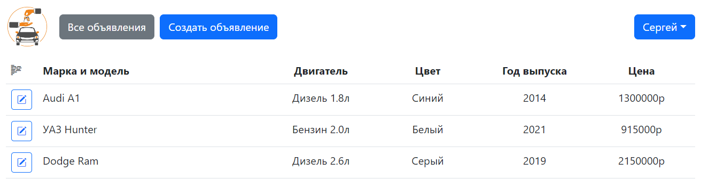

## job4j_cars

В данном проекте разработан сайт для размещения объявлений по продаже машин.
На данный момент функционал прост: регистрация и авторизация пользователя, просмотр списка объявлений о 
продаже и каждого объявления отдельно любыми пользователями, добавление и редактирование своих объявлений 
зарегистрированными пользователями. Также реализован поиск по объявлениям при помощи Criteria API.

База данных предзаполнена базовыми значениями моделей, корпусов автомобилей, типов коробки передач и т.п. 
данными. Вся эта информация загружается с помощью **Liquibase** из скриптов (см. db/scripts) при сборке 
проекта. 

В качестве основного используется **Spring Framework**. <br>
Страницы разработаны с помощью **Thymeleaf** и **Bootstrap**. Также в проекте используются основные 
зависимости **PostgreSQL 42.5.4**, **Liquibase 4.15.0** и **Hibernate 5.6.15.**.

### Требования к окружению:
* Java 17,
* PostgreSQL 14.0,
* Apache Maven 3.8.4

### Используемые технологии:
* Java 17
* Maven 3.8
* Spring Boot Starter 3.1.0
* * Web
* * Thymeleaf
* * Test
* Spring Security Test 6.1.0
* Hibernate 5.6.15
* PostgreSQL 14 (driver v.42.5.4)
* Liquibase 4.15.0
* H2database 2.1.214
* Lombok 1.18.28
* Checkstyle 3.1.2


* Junit Jupiter
* AssertJ
* Mockito
* Bootstrap
* Log4J

### Запуск проекта:
```
1. Для запуска проекта, Вам необходимо клонировать проект из этого репозитория;
2. Затем необходимо создать локальную базу данных "cars";
3. После - пропишите, пожалуйста, логин и пароль к созданной вами базе данных в ресурсные файлы 
db/liquibase.properties и resorces/hibernate.cfg.xml;
4. Далее запустите liquibase для предварительного создания таблиц, или смонтируйте проект;
5. Запустите приложение одним из представленных ниже способов:
  5.1 Через класс Main, находящийся в папке src\main\java\ru\job4j\cars;
  5.2 Скомпилировав и запустив проект через maven командой mvn spring-boot:run;
  5.3 Собрав проект через maven и запустив собранный файл командой java -jar job4j_cars-1.0-SNAPSHOT.jar;
6. Открыть в браузере страницу http://localhost:8080/index;
7. Вы великолепны!
```
### Доступные страницы:
**Главная страница, встречающая клиента, с открытой формой поиска и списком объявлений:**


**Форма для создания нового объявления (доступно зарегистрированным пользователям):**


**Страница объявления с подробным описанием автомобиля:**


**Форма для редактирования объявления (доступно зарегистрированным пользователям):**


**Регистрация пользователя:**


**Авторизация:**


**Список объявлений пользователя:**


**И страница с возможностью отредактировать данные пользователя:**


На этом пока всё...
#### Искренне благодарю за внимание к моему проекту! И хорошего Вам дня!

### Контакты для связи:
> <a href="https://github.com/Niaktes/">Захаренко Сергей</a> <br>
> Телефон: +7 995 299 07 34 <br>
<a href="https://t.me/Niaktes"></a>
<a href="https://wa.me/89265900734"></a>
<a href="mailto:Sergei.Rabota@gmail.com"></a>